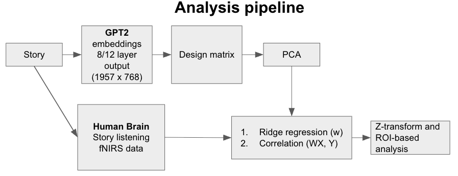
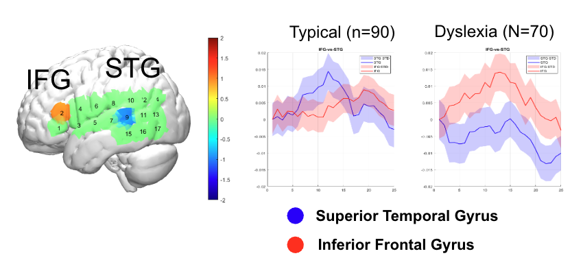

# fNIRS Data Processing pipelines for natual language processing (NLP)

This repository contains different MATLAB and Python scripts for fNIRS data processing pipelines (NLP tasks). 

**NOTE**:
## Suprisal Calculation

If you would like to calculate surprisal values yourself, please request access to the following package:

👉 [LingPred](https://github.com/cnllab/lingpred)

Access to LingPred is managed by **Dr. Jonathan Brennan (University of Michigan)**.  
Please reach out to him directly to obtain the necessary permissions before running the surprisal pipeline.  

Once you have access, follow the setup instructions provided in the LingPred repository to install dependencies and run the surprisal extraction tools.

<p align="left">
  
  
  
</p>

---

## Overview
This repository is organized into three main parts:
1. **Sample data**
   - five de-id data was included
   - 
2. **Data preparation**
   - Data preparation mainly based on Henry Huggings story listening data
   - Data cut (remove the q&a part and reconnect the story listening part)

3. **Three-Way split analysis**  
   - Suprisal calculation at 3 different levels lexcial/sytactical/phonem (with parallel workers)  
   - Data recoding - insert the suprisal data into fNIRS data to become its design matrix
   - First level, group level analysis and contrast and plotting are covered in https://github.com/xiaosuhu/fNIRS-DataProcessing-Pipelines-w-functions

4. **NLP forecasting with future words**  
   - GPT2 embeeding calculation  
   - HbO data prep for the analysis
   - design matrix prep
   - Calculate brain score (correlation) and brain forcast score (forcasted brain score)
   - Plotting and stats in Matlab
   - This method comes from the paper "Evidence of a predictive coding hierarchy in the human brain listening to speech" - https://www.nature.com/articles/s41562-022-01516-2

   Here is an illustration of the workflow:

   

### Results


---

## Installation
```bash
git clone https://github.com/xiaosuhu/fNIRS_NLP
cd yourrepo
conda env create -f environment.yml
conda activate yourenv
```

---

## Requirements
- Matlab:
  - Please have the following toolbox or pipelines in path:
    - https://github.com/huppertt/nirs-toolbox
    - https://github.com/xiaosuhu/fNIRS-DataProcessing-Pipelines-w-functions
- Python:
  - see the requriment.txt

---

## Contact
For questions or collaborations:  
**Frank Hu** – [xiaosuhu@umich.edu]  
